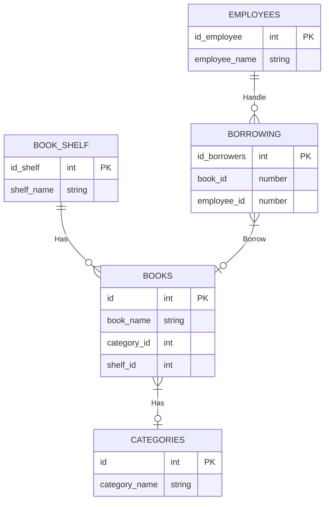
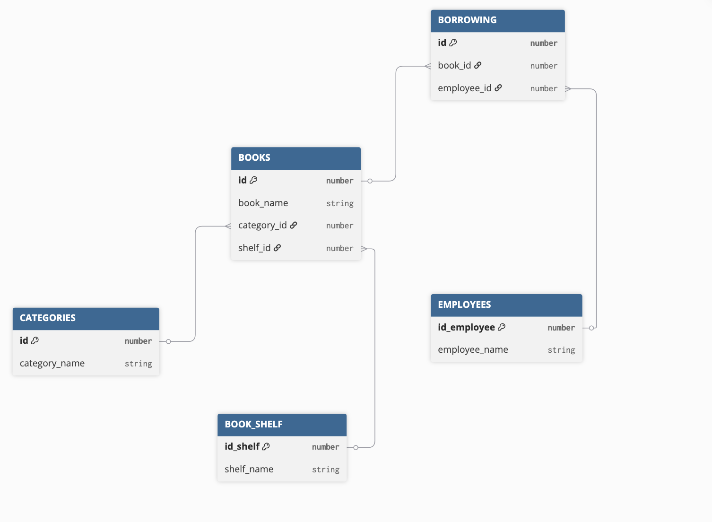

```mermaid
erDiagram
BOOKS{
  id int PK
  book_name string
  category_id int
  shelf_id int
}

CATEGORIES{
  id int PK
  category_name string
}

BOOKS }| --o| CATEGORIES : Has

BOOK_SHELF{
  id_shelf int PK
  shelf_name string
}

BOOK_SHELF || --o{ BOOKS : Has

EMPLOYEES{
  id_employee int PK
  employee_name string
}

EMPLOYEES || --o{ BORROWING : Handle

BORROWING{
  id_borrowers int PK
  book_id number
  employee_id number
}

BORROWING }| --o| BOOKS : Borrow

```

